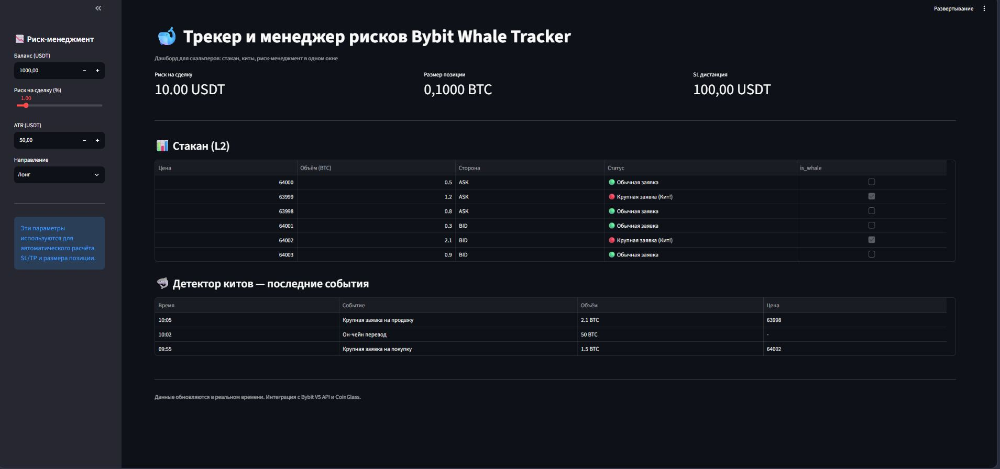
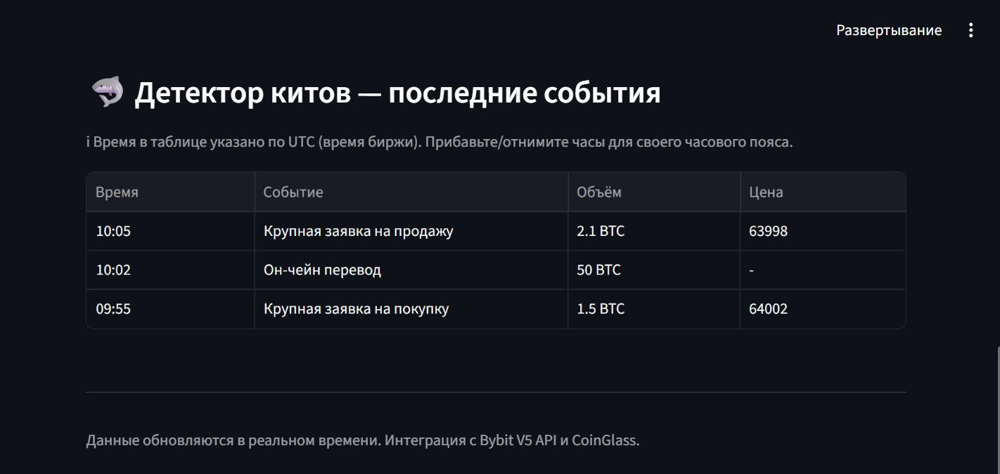
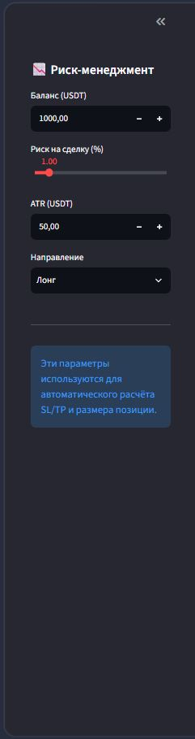
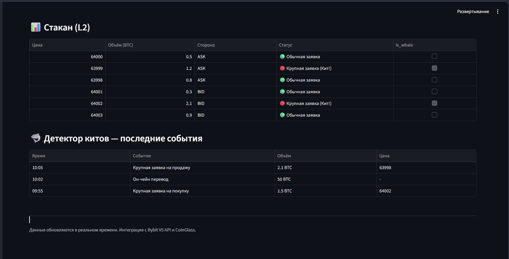
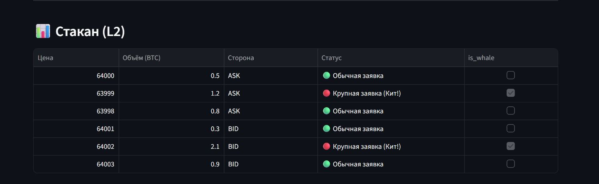

# # Bybit Whale Tracker MVP

Готовый прототип дашборда для скальперов. Инструмент для поиска торговых возможностей на бирже Bybit за счёт анализа крупных заявок («китов») в стакане L2.

## Что умеет сейчас

- **Детекция крупных заявок («китов») в стакане L2.** Мгновенно подсвечивает аномальные объёмы, которые могут двигать цену.
- **Автоматический расчёт SL/TP и размера позиции.** На основе объёма «кита» и текущей волатильности система сразу даёт готовые цифры для входа.
- **Фильтрация и агрегация данных.** Позволяет отсеивать «шум» и видеть только значимые уровни.

## Как это работает в связке с TradingView

Наш дашборд не пытается заменить TradingView — он даёт тебе «сырые» данные и готовые расчёты, чтобы ты принимал решение на привычном графике.

**Рабочий сценарий скальпера:**

1.  **Находишь уровень на TradingView.** Ты видишь на графике ТВ важный уровень поддержки/сопротивления.
2.  **Проверяешь стакан в дашборде.** Заходишь в наш дашборд и смотришь, есть ли у этого уровня крупные лимитные заявки («киты»). Если кит стоит на уровне — вероятность отработки сигнала резко растёт.
3.  **Берёшь готовые цифры.** Дашборд уже посчитал для тебя размер позиции, SL и TP. Тебе остаётся только перенести эти цифры на график в TradingView.

> **Важно:** Сейчас дашборд работает с данными стакана Bybit. Логика расчёта сигналов универсальна и подходит для любой биржи, где есть стакан L2.

## Презентация возможностей: скриншоты интерфейса

Ниже — 5 ключевых экранов, которые закрывают 90% задач скальпера.

### Главная панель: вся картина на одном экране

Здесь собраны ключевые метрики стакана и активности китов, чтобы ты не тратил время на ручной мониторинг.

*На скриншоте — полный вид панели: глубина стакана, крупные лимитные заявки, агрегированные объёмы и текущие сигналы на вход.*

---

### Фокус на «китах»: кто двигает рынок

Отдельный блок посвящён крупным заявкам («китам») в стакане. Ты видишь не просто цифры, а их поведение: где стоят крупные лимиты, как они двигаются и есть ли риск пробоя уровня.

*На этом экране — таблица с крупными заявками и график их активности. Цветами подсвечены уровни, где есть риск резкого движения цены.*

---

### Гибкие фильтры: настраивай под себя

Панель фильтров позволяет сузить выборку до нужных параметров: по объёму заявки, типу ордера или таймфрейму. Это экономит часы ручного анализа стакана.

*Пример работы фильтров: можно быстро выделить только заявки свыше 10 BTC или только лимитные ордера на продажу.*

---

### Данные без лишнего шума: чистая таблица

Иногда нужны не графики, а чистая таблица — чтобы выгрузить в Excel или сверить с другими системами.

*Полный список крупных заявок без визуальных панелей — для глубокой аналитики и ручной проверки сигналов.*

---

### Документация и примеры: логика расчёта

Мы предусмотрели не только визуализацию, но и удобные справочные материалы.

*Здесь — примеры типовых сигналов, подсказки по работе с интерфейсом и логика расчёта SL/TP.*

## Как запустить

1.  Активируй виртуальное окружение.
2.  Запусти: `streamlit run app.py`

## Техническая информация

- **Стек:** Python, Streamlit, Bybit API.
- **Статус:** MVP (минимально жизнеспособный продукт).
